# Async Methods Actor

 

A library that extends the Actor Framework to allow for async method execution.

The **Async Methods Actor** is an actor-based library that implements an infrastructure for launching async methods. By making actors inherit from the **Async Methods Actor**, it is possible to launch any method without waiting for its conclusion, by sending messages child of the abstract message "**Async Message.lvclass**". This framework is especially useful for tasks that take a long time to execute which implemented as Actor methods would lock the actor until completion. In the Actor Framework, the official way to implement those tasks, without locking the Actor, is to code them as helper loops within the "Actor Core.vi". This however brings along the overhead of setting up a communication mechanism between Actor methods and the helper loop, thus voiding the advantage of OOP encapsulation. By means of this framework, you continue to benefit from OOP encapsulation of the Actor Framework also for long execution tasks without needing to implement boilerplate code.

***It’s important to note that Async Methods are not supposed to alter the input object; indeed, the output object is effectively discarded. This is because, otherwise, we would void the essence of the Actor Model. If the user wants to alter the current Actor object, he will need to use standard Actor messages.***

## Quick-Start Guide

1. Install the **Async Methods Actor** VIPM Package by means of the VI Package Manager. The VIPM package can be found <a href="https://www.vipm.io/package/ls_instruments_ag_lib_async_methods_actor/" target="_blank">here</a> 
2. Install the **LSI Actor Framework Message Maker** by means of the VI Package Manager. You can find details about the package  <a href="https://www.vipm.io/package/ls_instruments_ag_lib_lsi_actor_framework_message_maker/" target="_blank">here</a>

### Create Async Methods Actors
Right-click on a target within a LabVIEW project, in most cases it will be "My Computer" and click on the "New > Async Methods Actor" sub-menu:

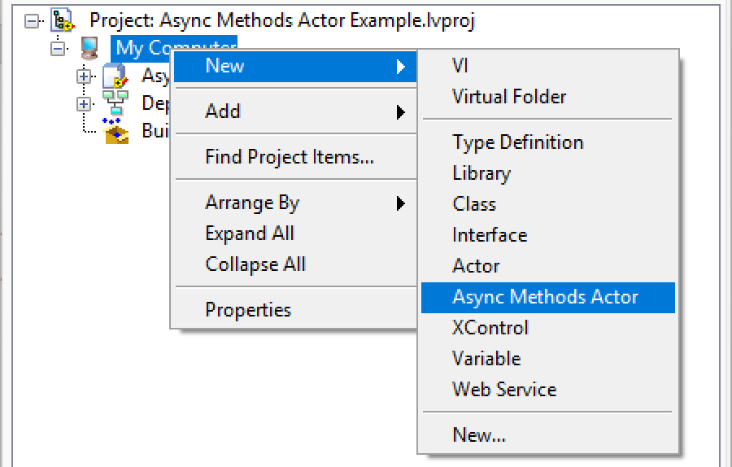

The **Async Methods Actor** Creator window will appear:

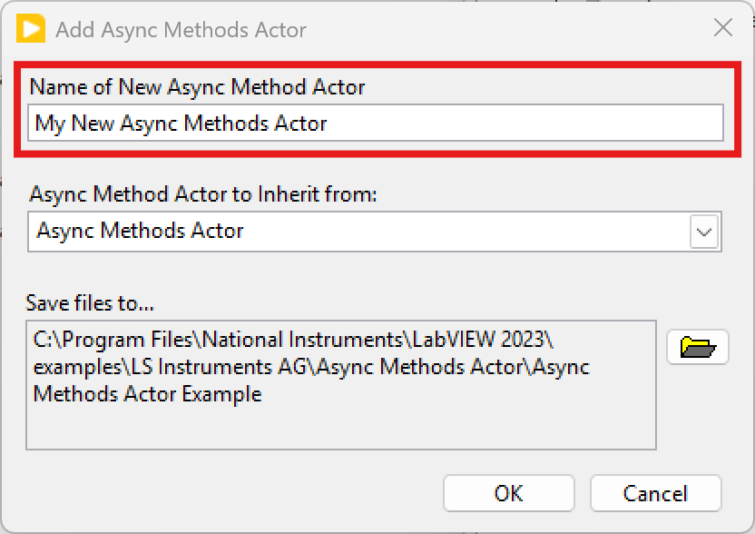

Therein you will be able to choose the **Async Methods Actor** name, from which **Async Methods Actor** to inherit from, and where to store the **Async Methods Actor** on disk. Then click "OK". A new library will be created containing the **Async Methods Actor** within your project under the chosen target:

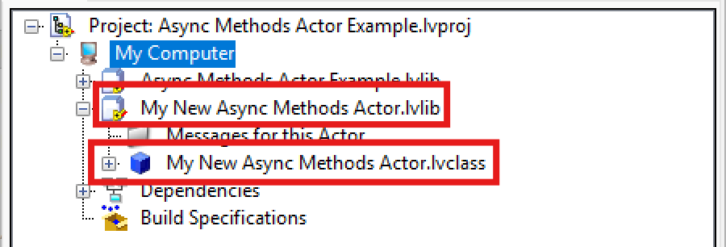

If you want to add an **Async Methods Actor** to the newly created library and inherit from the just created actor, right click on the library and launch again the **Async Methods Actor** creator:

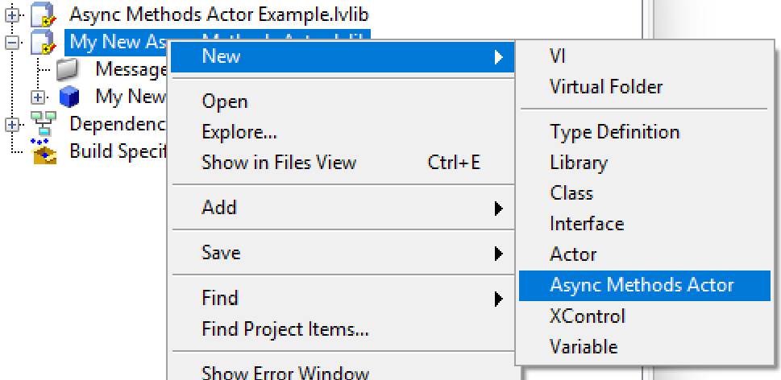

The **Async Methods Actor** creator window will appear. Here choose a new name and choose to inherit from the previously created Async Actor. Click "OK":

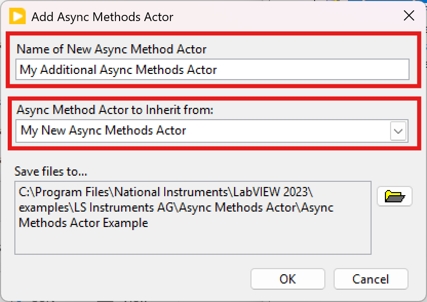

The new **Async Methods Actor** will be created within the previous library, without creating a new one.

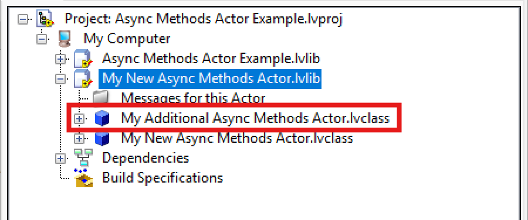

### Create Async Messages

In order to add some meaningful functionalities to the **Async Methods Actors** that you created you have to implement methods and the corresponding messages to be able to call them. As an example, add two methods to the **Async Methods Actors** just created:

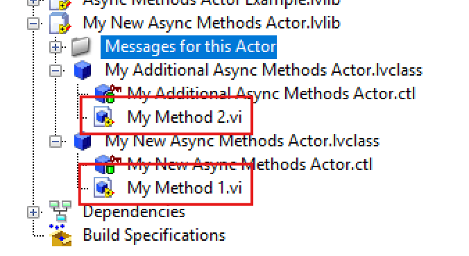

Launch the **LSI Actor Framework Message Maker**:

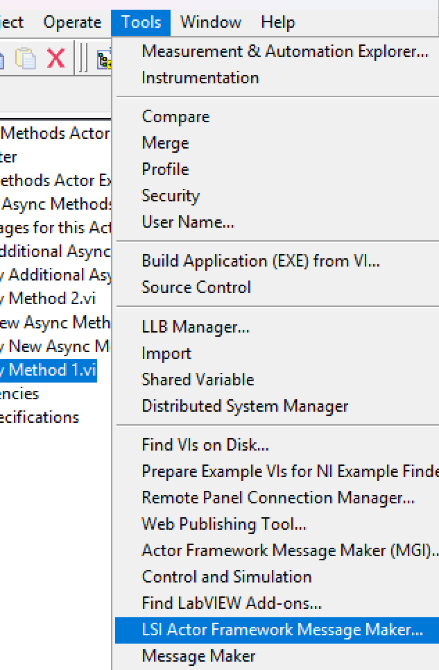

The Message Maker window will appear, select the two methods for which you want to create an **Async Message** (select the "Async Message" child of the Async Methods Actor's method to create an Async messages instead of a standard Actor messages) an then click the "Build/Update Selected Message(s)" button:

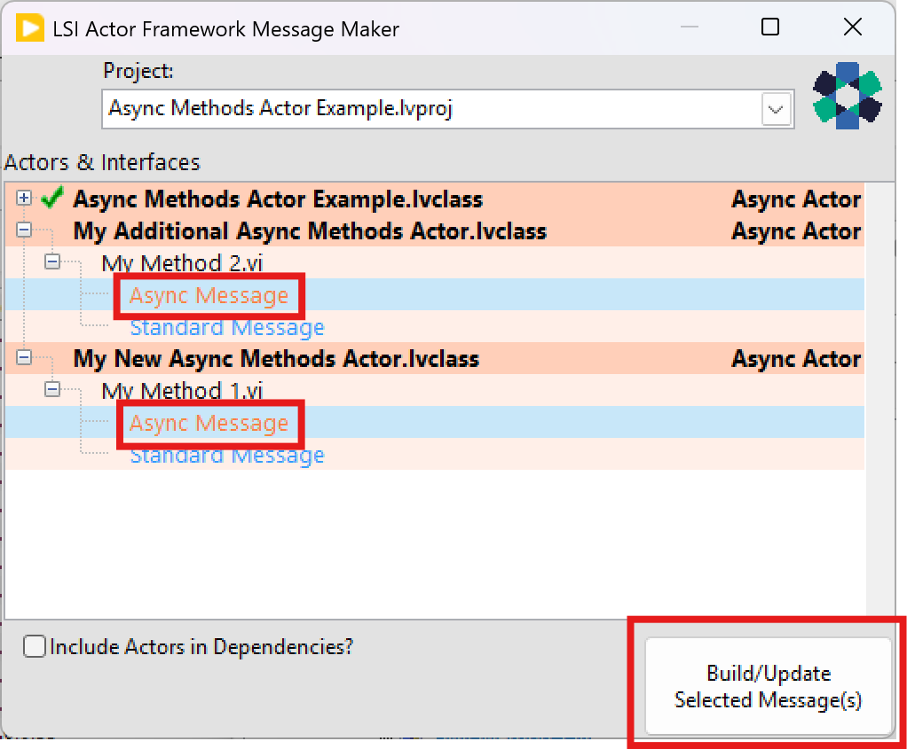

This will create the two messages. Exit the Message Maker window and you will see the new messages appearing in the project:

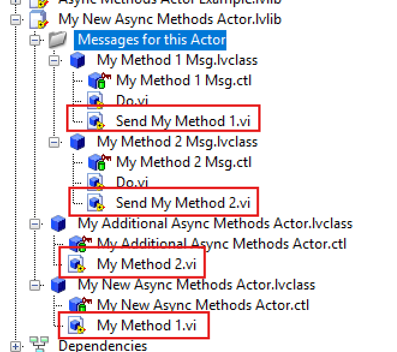

If you change either the VI Icon, the VI Description, or the VI connector pane of the **Async Methods Actor** methods you can relaunch the **LSI Actor Framework Message Maker** and rebuild the messages to reflect the changes:

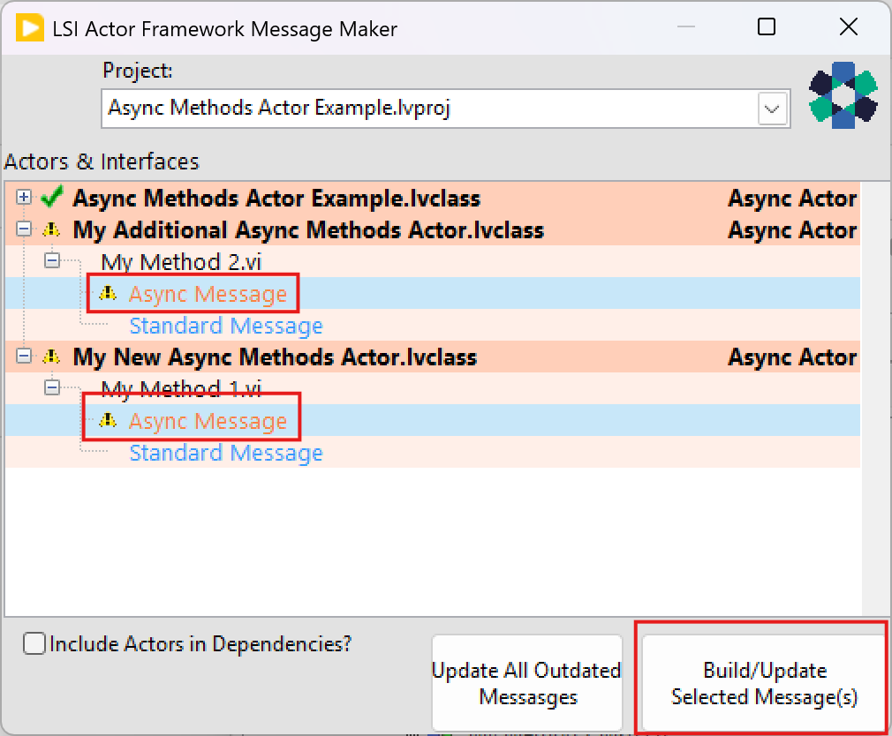

### Send the Async Messages to the Async Methods Actor

You are now ready to call the two methods asynchronously from within your code, to this end send each Async message through the corresponding **Send** method as you would normally do within the AF.

If you want to get more control over the asynchronous call you can wire a suitably configured copy of the "**Async Message Settings**" cluster to the message's **Send** methods as shown in the following picture:

Through the "**Async Message Settings**" cluster you can set:

1. a **Message Priority** enum and you would wire to the standard AF send VI
2. an "**Async Call Method**" enum that can take values "Call and Collect" or "Call and forget" (see further details in the following documentation)
3. a "**VI Refnum Lifetime**" enum. This can take values "Destroy on Exit", " Destroy on Actor Exit", and “Destroy on Application Exit"  (see further details in the following documentation)
4. a "**Report Errors (T)**" Boolean. If TRUE the standard error output of the Async Method will be reported to the calling actor.
5. a previously created concrete subclass of the "**Completion Notification Msg**" and a **Caller Enqueuer**. If both fields are set, upon completion of the "Call and Collect" Async Message method the Async Method Actor will send the aforementioned concrete "**Completion Notification Msg**" message to the caller which will enable the caller to obtain a copy of the **Async Message** and the current number of running "Call and Collect" messages of this kind. The copy of the message will allow the caller to access the GUID and FQN of the conclude Async Message by means of the corresponding Async Message properties 

## Example Code
The library comes with an example that illustrates the full API. Within the source tree the examples can be found at the path `./Async Methods Actor Example`. When installing the VIPM package you will find the example at the path `(LabVIEW Root Path)/examples/LS Instruments AG/Async Methods Actor/Async Methods Actor Example`

# Methods and Classes Documentation

## The "Async Methods Actor.lvclass" Actor Class
Actor that implements an infrastructure for launching async methods. By making actors inherit from this actor, it is possible to execute any method without waiting for its conclusion and not locking the actor during its execution, by sending messages child of the abstract message "**Async Message.lvclass**". This framework is especially useful for tasks that take a long time to execute which implemented as Actor methods would lock the actor until completion. The official way to implement those tasks in the Actor Framework is to code them as helper loops within the "**Actor Core.vi**". This however brings along the overhead of setting up a communication mechanism between Actor methods and the helper loops, thus voiding the advantage of OOP encapsulation. Using this framework you continue to benefit from OOP encapsulation of the Actor Framework for long execution tasks without having to implement ad-hoc data transfer methods between methods and helper loops.

### The "Running Methods Communication" Property

This property allows setting up a communication method based either on a notifier or an event structure that allows the subscriber to receive information about the Async Messages currently running. The subscriber will receive the FQN of the running Async Messages, the number of running  Async Messages launched by the "Call & Collect" method and the number of launched  Async Messages launched by the "Call & Collect" method. The setting is controlled by the "**Running Methods Communication**" enum that can take values "None" (default), "Notifier" and "Event": the first disables the communication, the second sets it up by means of a notifier that can be accessed by means of the "**Async Messages Running Notifier**" property while the third  sets it up by means of a event mechanism whose reference can be accessed by means of the "**Async Messages Running Event Ref**" property.

## The "Async Message.lvclass" Abstract Message
Subclass this message and implement the **Do.vi** method to execute such a method in an async manner. This is useful for long-lasting methods that would lock the actor during their execution. You can configure this message by setting the "**Async Call Method**" property. The property enumeration can take values "Call and Collect" and "Call and Forget". In the former case the "**Async Methods Actor**" will track the execution of the methods by waiting for their completion, in the latter case instead the actor will not wait for their completion but will just count their launch. The execution of "Call and Collect" methods and the launch of "Call and Forget" can be followed by subscribing to the "**Async Methods Running Notifier**" available from the corresponding property of the "**Async Methods Actor**". "Call and Forget" use is discouraged and is meant to cater to situations where the lifetime of the method execution is supposed to survive the lifetime of the "**Async Methods Actor**". The message can be also configured by setting a previously created concrete subclass of the "**Completion Notification Msg**" and a caller enqueuer, if both settings are performed upon completion of the "Call and Collect" Async Message method the **Async Methods Actor** will send the aforementioned concrete "**Completion Notification Msg**" message to the caller that will enable the caller to obtain a copy of the Async Message and the current number of running "Call and Collect" messages of this kind. The copy of the message will allow the caller to access the GUID and FQN of the conclude Async Message by means of the corresponding Async Message properties

### The "Send Async Message.vi" Method

This VI sends a concrete Async Message to an "**Async Methods Actor**" actor. 

Wire a properly configured (see message documentation for discovering configuration options) concrete subclass of the "Async Message" terminal to call a specific method of a subclass of the "**Async Methods Actor**".  The VI will output the GUID generated for the corresponding message sending.

#### Optionally you can wire:

an "**Async Call Method**" enumeration. This can take values "Call and Collect" and "Call and Forget". In the former case the "Async Methods Actor" will track the execution of the methods by waiting for their completion, in the latter case instead the actor will not wait for their completion but will just count their launch.

a "**VI Refnum Lifetime**" enumeration. This can take values "Destroy on Exit", " Destroy on Actor Exit", and “Destroy on Application Exit”. This enumeration dictates the lifetime strategy adopted for the VI Refnum of the Async Method. In the first case the **Async Methods Actor** destroys the reference as soon as the Async Method exits. In the second case the VI Refnums will be destroyed once the “Async Method Actor” exits, while in the last case, VI Refnums are never destroyed. “Destroy on Exit” is the default option when unwired. The motivation for this setting is related to the required lifetimes of the Refnums (e.g. notifier’s references) created within the Async Method. This lifetime is the same as the VI Refnum lifetime, hence if we want they outlive the execution of the Async Method we have to set it to either “Destroy on Actor Exit” or “Destroy on Application Exit”. This option applies only to Async Methods called with the “Call and Collect” option.

a "**Report Errors (T)**" Boolean. If True the standard error output of the Async Method will be reported to the calling actor.

### The "Caller Enqueuer" Property

Sets the caller enqueuer to which notify  the completion of the **Async Method** by means of the concrete subclass of the "**Completion Notification Msg.lvclass**" (specified by the "**Completion Notification Msg**" property). The caller will receive the completed Async Message allowing the access, by means of its properties, to its GUID and FQN as well as the remaining number of "Call and Collect" Async Messages of the same type. To enable the callee Async Methods Actor to notify completion both this property and the "**Completion Notification Msg**" property must be properly set.

### The "Completion Notification Msg" Property

Sets a concrete subclass of the "**Completion Notification Msg.lvclass**" abstract message (or of the "**Compl Notif with Error Msg.lvclass**" abstract message) to notify the caller (specified by the "**Caller Enqueuer**" property) about completion of **Async Message**. The caller will receive the completed Async Message allowing the access, by means of its properties, to its GUID and FQN as well as the remaining number of "Call and Collect" Async Messages of the same type. To enable the callee Async Methods Actor to notify completion both this property and the "**Caller Enqueuer**" must be properly set.

## The "Completion Notification Msg.lvclass" Abstract Message

A concrete subclass of this abstract message is used to send the caller information about the "Call & Collect" Async Message whose execution comes to completion. Information includes the message itself, including its FQN and GUID accessible by the corresponding properties, and the current number of running Call & Collect Async Messages of this type

## The "Compl Notif with Error Msg.lvclass" Abstract Message

This abstract class is a subclass of the “**Completion Notification Msg**" class, besides its parent class functionalities, this class merges the error generated as standard error output by the Async Method just called to the standard error input of the dynamic dispatch method "**Do Core.vi**". Hence concrete subclasses of this class must override the "Do Core.vi" method to perform suitable method calls.

## Attribution

This library incorporates portions of the [NI Actor Framework](https://github.com/ni/actor-framework), 
which is Copyright (c) National Instruments Corporation and licensed under the MIT License.
